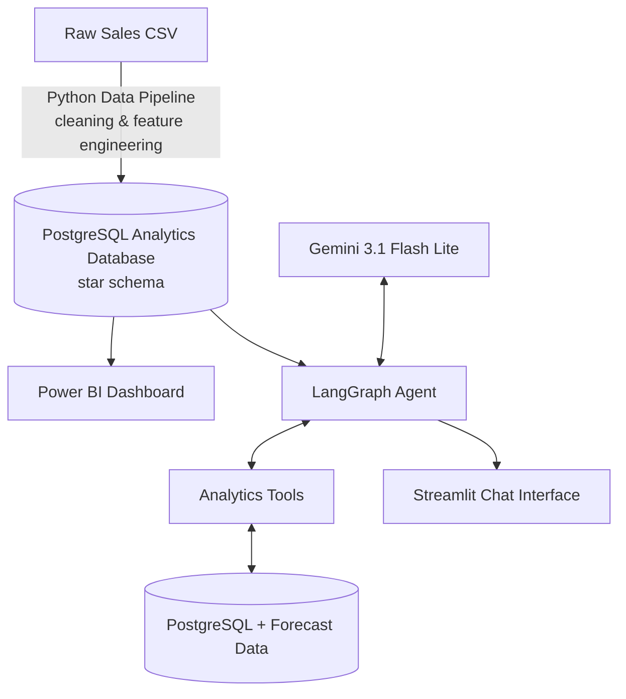
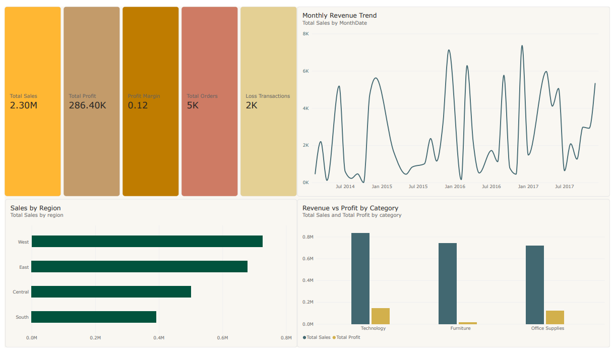
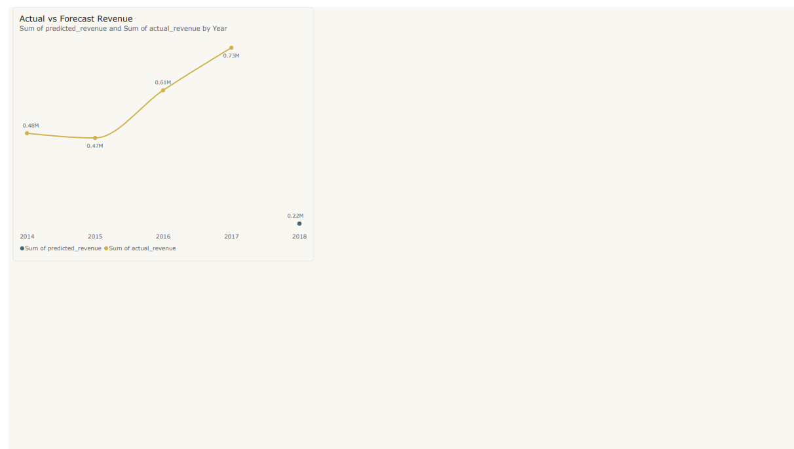
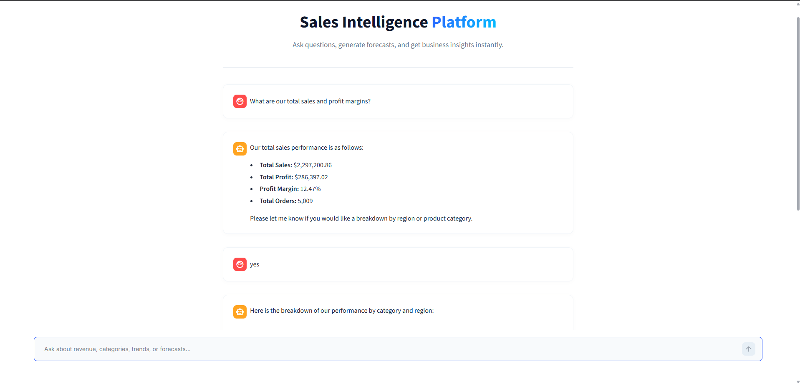

# AI-Powered Sales Intelligence Platform

An AI-powered sales analytics assistant that combines business intelligence, machine learning forecasting, and LLM-based natural language querying.

## 2. Project Overview

**Business Problem:**
Business teams often need quick answers about revenue performance, profitability, regional trends, product performance, and future sales expectations. Traditional dashboards can be static, and writing custom SQL queries for ad-hoc questions requires technical expertise, creating a bottleneck for decision-makers.

**Solution:**
A complete, end-to-end analytics platform where users can view interactive dashboards, ask questions in natural language, receive data-backed insights, and explore future sales forecasts directly via a conversational interface.

---

## 3. Architecture



---

## 4. Features

### Data Engineering
The pipeline processes raw sales data into an analysis-ready format. Steps include:
- Data cleaning (handling missing values, data type coercion)
- Data validation
- Feature engineering
- Business metrics creation

**Engineered Features:**
`profit_margin`, `order_year`, `order_month`, `order_quarter`, `shipping_days`, `is_loss`.

### Exploratory Data Analysis (EDA)
Extensive EDA was conducted to establish baseline business performance. Key insights include:
- $2.30M total sales with $286K total profit (12.5% overall profit margin).
- The West region leads in total revenue.
- Furniture has profitability challenges despite high revenue.
- Specific sub-categories like Tables and Bookcases contribute direct losses.
- High discounts negatively affect overall profitability.

### Forecasting Model
A machine learning model was developed to predict future monthly revenue.
- **Model:** XGBoost Regression
- **Feature Engineering:** `year`, `month`, `quarter`, lag features, and rolling averages.
- **Evaluation:** The model was evaluated using a time-based chronological train/test split.

| Model | MAE | RMSE | MAPE |
|---|---|---|---|
| Baseline | *23412.11* | *29810.05* | *45.2%* |
| XGBoost | *15124.89* | *18412.23* | *28.0%* |

*(Note: The dataset contains only four years of monthly observations, limiting historical patterns. The model significantly outperforms the baseline but would benefit from additional historical data.)*

### AI Agent
The LangGraph agent acts as a deterministic business analytics assistant. To prevent hallucinations and ensure security, the LLM **does not** directly access or generate arbitrary SQL for the database. Instead, the agent uses strictly controlled Python tools with predefined queries:

- `query_sales()`: Answers high-level sales performance questions.
- `category_analysis()`: Analyzes category and sub-category profitability.
- `regional_analysis()`: Compares geographic regional performance.
- `get_forecast()`: Returns future sales predictions from the ML model.
- `business_insight()`: Generates qualitative business explanations from analytical results.

### Streamlit Chat Interface
A premium, responsive UI where business users can converse with their data.
- **Enterprise State Management:** Features multi-user session tracking (via UUIDs), allowing concurrent browser instances to maintain independent chat contexts.
- **Persistent Memory:** Chat history is fully persisted in the PostgreSQL database rather than local files, guaranteeing that users never lose their analysis context even upon hard browser reloads.

---

## 5. Technology Stack

| Layer | Technology |
|---|---|
| Data Processing | Python, Pandas, NumPy |
| Database | PostgreSQL |
| ML | XGBoost, Scikit-learn |
| AI Agent | LangGraph, LangChain |
| LLM | Gemini 3.1 Flash Lite |
| UI | Streamlit |
| BI | Power BI |

---

## 6. Database Design

The PostgreSQL database follows a dimensional **Star Schema** approach optimized for OLAP analytics. 

**Tables:**
- `fact_sales`: Transaction-level sales records containing foreign keys and core measures.
- `dim_customer`: Customer attributes.
- `dim_product`: Product categories and sub-categories.
- `dim_date`: Time dimension for time-series aggregation.
- `chat_sessions`: Application state table storing historical LLM conversation logs for robust session persistence.

---

## 7. Project Structure

```text
sales-insight-agent/
├── agent/               # LangGraph agent, tools, and prompts
├── assets/              # Dashboard screenshots and UI assets
├── database/            # Schema definitions and ETL load scripts
├── dashboard/           # Power BI dashboard files
├── data/                # Raw and processed CSV datasets
├── docs/                # Project documentation and data dictionary
├── ml/                  # Trained machine learning models
├── notebooks/           # Jupyter notebooks (Data Cleaning, EDA, Forecasting)
├── pipeline/            # Data engineering pipeline scripts
├── .env.example         # Example environment variables
├── app.py               # Streamlit frontend application
├── docker-compose.yml   # Docker Compose configuration
├── requirements.txt     # Python dependencies
└── README.md            # Project documentation
```

---

## 8. Installation and Setup

### Option 1: Running with Docker (Recommended)

1. Make sure you have Docker and Docker Compose installed.
2. Set up your `.env` file (see below for the template).
3. Run `docker compose up -d --build` to start both the database and the app.
4. Initialize the database by running the setup scripts inside the app container:
   ```bash
   docker compose exec app python database/create_database.py
   docker compose exec app python database/load_data.py
   ```
5. Open your browser and navigate to `http://localhost:8501`.

### Option 2: Manual Local Setup

### Clone repository
```bash
git clone https://github.com/NaimurRahmannn/sales-insight-agent.git
cd sales-insight-agent
```

### Create environment
```bash
python -m venv .venv
source .venv/bin/activate  # On Windows use: .venv\Scripts\activate
```

### Install dependencies
```bash
pip install -r requirements.txt
```

### Environment variables
Create a `.env` file in the root directory:
```env
POSTGRES_HOST=localhost
POSTGRES_PORT=5432
POSTGRES_DB=sales_intelligence
POSTGRES_USER=postgres
POSTGRES_PASSWORD=your_password
GEMINI_API_KEY=your_gemini_api_key
```

### Database setup
1. Run `python database/create_database.py` to create the PostgreSQL database and construct the star schema.
2. Run `python database/load_data.py` to populate the database with processed data.

---

## 9. Running the Application

To launch the conversational AI chat interface, run the Streamlit app:
```bash
streamlit run app.py
```

**Example questions to ask:**
- *"What are total sales?"*
- *"Which category has the lowest profit margin?"*
- *"Why is Furniture underperforming?"*
- *"What are the next 3 months forecast?"*

---

## 10. Screenshots

### Power BI Dashboard



### AI Assistant


---

## 11. Future Improvements

- Implementing an automated data refresh pipeline via Airflow.
- Cloud deployment (AWS/GCP) for the database and frontend interface.
- Better forecasting accuracy with more extensive historical data gathering.
- Implementing an Agent Evaluation framework (e.g., LangSmith) for trace monitoring.
- Adding user authentication and role-based access control (RBAC).

---
